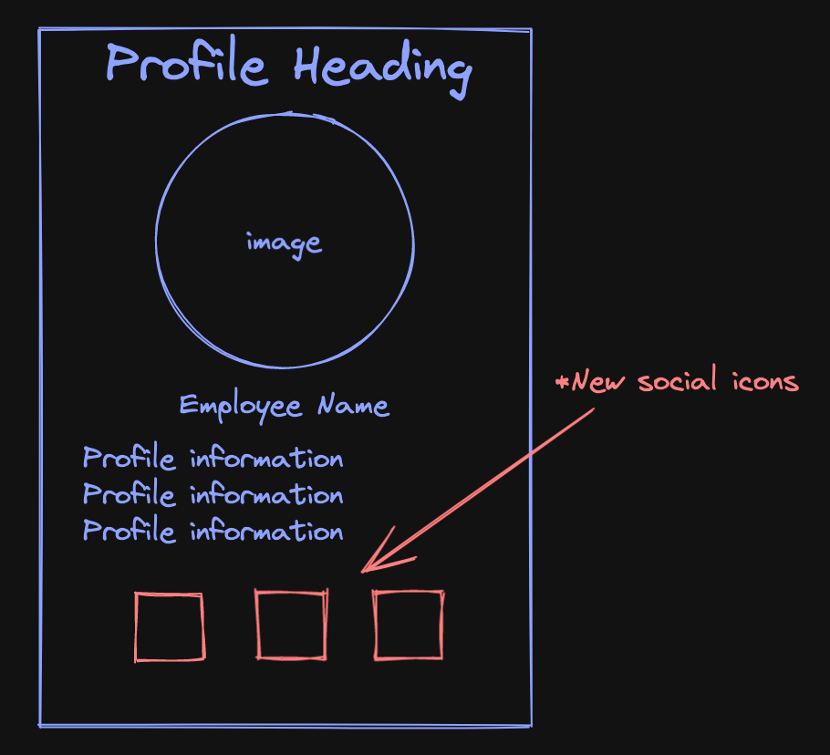

# [ widgets ] - ex01 – Simple Layouts Exercise

### Description
Update the employee profile example to include three social icons at the bottom of the page. Search online for suitable icon images (e.g. png with transparency would be good).

### Requirements
- Download the existing final version of the employee profile example completed in class
- Search online for three suitable social icons to use in your app (e.g. facebook, twitter, Instagram, etc.)
- Include the images in your app as required
- Update the app UI to include the three social icons arranged in a row at the bottom of the page
- Your page may look something like the following once complete:

