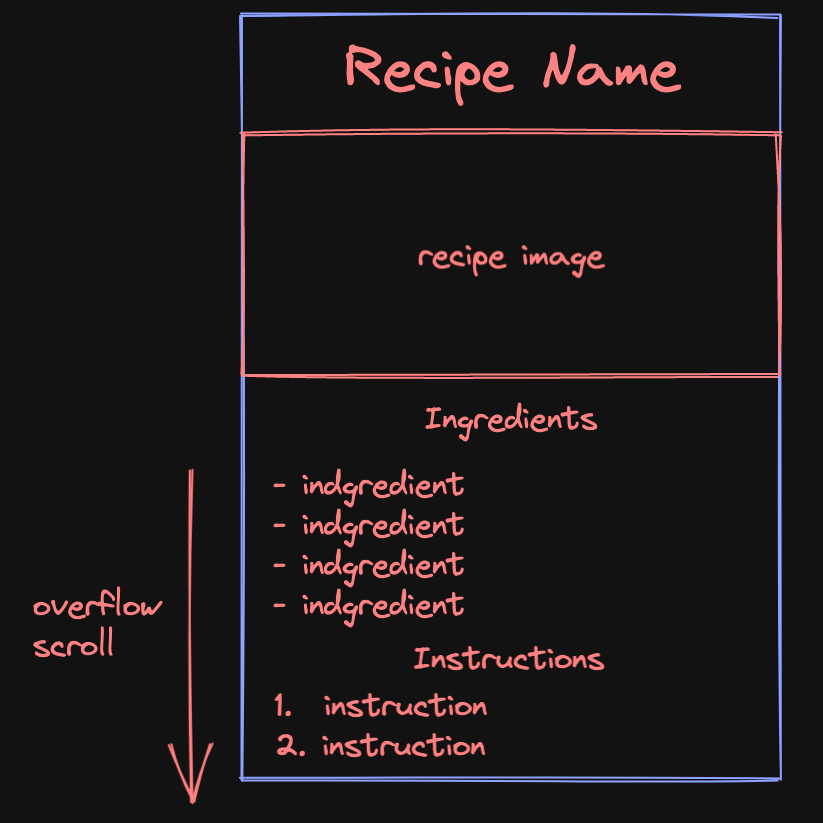

# DMIT2504 - ex03 – Simple Layouts Exercise

### Requirements
- Use any widgets necessary to achieve the desired design
- Look for repeated widget use to determine custom widgets that would help reduce development time, and help organize your solution (e.g. ingredient lines, section headings)
- You will also have to do a little research to find out how to deal with overflow; your UI should allow the user to scroll to see any content that does not fit on the initial device screen
- Your page may look something like the following once complete:

