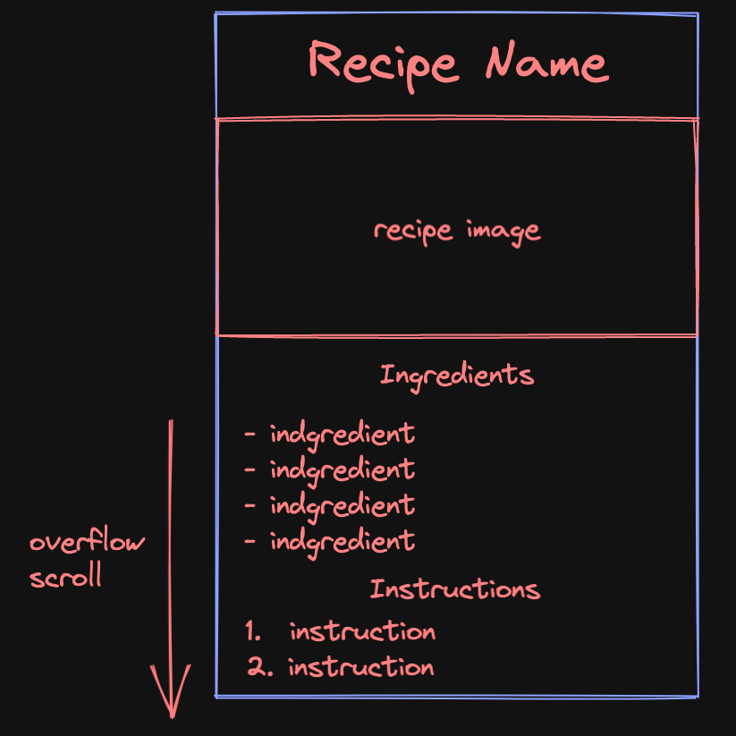

# DMIT2504 - ex04 – Simple Themes Exercise

### Description
Update the theme for the recipe solution from the previous exercise (the UI wireframe is included below).

### Requirements
- Change the overall primary colour of the theme colour scheme (pick any colour you like)
- Update the recipe image with a top and bottom border
  - You can choose the size and colour of the border
- Update the Recipe Name heading to use a custom font (you can download font files from [Google Fonts](https://fonts.google.com/))
  - You can learn more about custom fonts from the [Flutter cookbook](https://docs.flutter.dev/cookbook/design/fonts)
- Make any other additional style/theme updates you feel are appropriate

